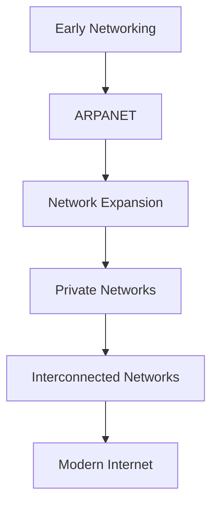

<div align="center">


**Study notes on the beginning of networking, ARPANET, its growth, and private networks**

[Beginning](#1-beginning-of-networking) |
[ARPANET](#2-arpanet) |
[Growth](#3-growth-of-arpanet) |
[Private Networks](#4-private-networks) |
[NetSentinel-XDR](#connection-with-netsentinel-xdr) |
[Exam Points](#exam-oriented-points) |
[Questions](#important-questions) |
[Revision](#quick-revision) |
[Knowledge Check](#knowledge-check)

</div>

---

> [!NOTE]
> **Source convention.** Sections marked **Lecture Content** contain only the facts, dates, sequence, and terminology of the lecture. Boxes marked **Additional Understanding** contain general knowledge that goes beyond the lecture and must not be quoted as lecture facts. Where the lecture gives no information, the notes say so instead of filling the gap.

## Contents

| No. | Topic | Key idea |
|---|---|---|
| 1 | Beginning of Networking | From research (1959 to 1966) to the first connection (1969) |
| 2 | ARPANET | First connection between UCLA and SRI on October 29, 1969 |
| 3 | Growth of ARPANET | 4 nodes in 1969 to 23 nodes in 1972; international connections in 1973 |
| 4 | Private Networks | Five private networks between 1974 and 1981 |
| - | NetSentinel-XDR | Conceptual comparison with a modern network monitoring system |

---

## 1. Beginning of Networking

<div align="center">

</div>

### Lecture Content

| Year | Event |
|---|---|
| 1959 | ARPA |
| 1960-1966 | Theoretical research |
| 1966 | ARPANET formally proposed |
| 1968 | BBN tasked to design interfacing processors |
| October 29, 1969 | First ARPANET connection between UCLA and SRI |

**Explanation of each point**

- **1959, ARPA.** The starting point of the timeline.
- **1960-1966, theoretical research.** Several years of research on the ideas of networking took place before any network was built. The work in this period was theoretical, not an operating network.
- **1966, ARPANET formally proposed.** The research led to a formal proposal. From this point ARPANET was a defined project.
- **1968, BBN tasked to design interfacing processors.** BBN was given the task of designing the interfacing processors. The wording indicates that special processors were needed to interface the participating computers with the network.
- **October 29, 1969, first ARPANET connection.** The first working connection of ARPANET, between **UCLA** and **SRI**.

**Significance of the sequence.** The order shows a clear development path: organization, then theory, then a formal proposal, then design of the interfacing hardware, and finally a real connection. Networking began as research and planning and became a working system only after the proposal and design stages.

```
1959
  |   ARPA
  v
1960-1966
  |   Theoretical research
  v
1966
  |   ARPANET formally proposed
  v
1968
  |   BBN tasked to design interfacing processors
  v
1969
      First ARPANET connection (UCLA and SRI), October 29
```

> [!NOTE]
> **Additional Understanding**
> - **ARPA** stands for Advanced Research Projects Agency, a research agency of the United States Department of Defense. Many references give 1958 as the year ARPA was established. For answers that follow the lecture, use 1959 as given.
> - **BBN** stands for Bolt Beranek and Newman.
> - The interfacing processors designed by BBN are commonly called **IMPs (Interface Message Processors)**.
> - The theoretical research of the early 1960s is commonly associated with the development of **packet switching**.

---

## 2. ARPANET

<div align="center">

</div>

### Lecture Content

**What ARPANET was.** ARPANET was the network formally proposed in 1966 as an outcome of the theoretical research of 1960-1966. Its first connection was made on **October 29, 1969**, between **UCLA** and **SRI**.

| Item | Detail |
|---|---|
| Date | October 29, 1969 |
| Endpoints | UCLA and SRI |
| Significance | First ARPANET connection |

```
UCLA
  |
  | Network Connection
  |
SRI
```

**Importance in the development of computer networking.** ARPANET is the central event of early networking history. The research of 1960-1966 led to the 1966 proposal, the 1968 design work by BBN, and the 1969 UCLA-SRI connection. The growth data in the next topic (4 nodes in 1969 to 23 nodes in 1972, and international connections in 1973) shows that this first connection was the start of a continuously expanding network.

**Purpose of ARPANET.** The lecture points used for these notes record when and how ARPANET was proposed, designed, and first connected. They do not state a specific reason for its development. Any statement of purpose is therefore given below as Additional Understanding.

> [!NOTE]
> **Additional Understanding**
> - **Why ARPANET was developed:** to allow research computers at different locations to be connected so that resources and information could be shared, and as an experiment in building a resilient network.
> - **Names:** UCLA is the University of California, Los Angeles. SRI is the Stanford Research Institute.
> - **First message:** the first message was an attempt to log in to the remote system. The system failed after the first two characters, "LO", and the full message was sent successfully later the same day.
> - **Foundation of the Internet:** ARPANET is widely regarded as a direct predecessor of the Internet. The protocols now known as TCP/IP were developed later, and ARPANET moved to them in 1983. This is general historical knowledge and is not stated in the lecture.

### Link to NetSentinel-XDR

ARPANET relates to NetSentinel-XDR only at a conceptual level: it is an early example of interconnected computers communicating over a network, which is the environment a monitoring system observes today. See [Connection with NetSentinel-XDR](#connection-with-netsentinel-xdr) for the full comparison and its verification status.

---

## 3. Growth of ARPANET

<div align="center">

</div>

### Lecture Content

The number of nodes increased each year from 1969 to 1972. In **1973**, the first **international connections** were made, to **Norway and the UK**.

### Timeline/Table

| Year | Number of Nodes |
|------|-----------------|
| 1969 | 4 |
| 1970 | 13 |
| 1971 | 18 |
| 1972 | 23 |
| 1973 | International connection |

**Year-by-year increase (calculated from the table)**

| Period | Increase in nodes |
|---|---|
| 1969 to 1970 | 9 (from 4 to 13) |
| 1970 to 1971 | 5 (from 13 to 18) |
| 1971 to 1972 | 5 (from 18 to 23) |

**What this growth demonstrates**

- **Rapid expansion.** From 4 nodes in 1969 to 23 nodes in 1972, more than five times as many nodes in three years.
- **Continuous growth.** The number of nodes increased in every year listed.
- **Geographic expansion.** The 1973 entry shows that the network extended beyond a single country, with first international connections to Norway and the UK.
- **A network can grow by adding nodes.** The four-node network of 1969 was extended rather than replaced.

> [!IMPORTANT]
> The 1973 row records an event, not a node count. The lecture gives no node count for 1973, so none should be written in an answer.

> [!NOTE]
> **Additional Understanding.** The connection to Norway is commonly associated with NORSAR, and the connection to the UK with University College London. Growth continued well beyond 1973, and the interconnection of networks eventually led to the Internet.

---

## 4. Private Networks

<div align="center">

</div>

### Lecture Content

After ARPANET, the lecture lists several **private networks** developed by companies and other organizations.

### Timeline/Table

| Year | Network | Organization/Company |
|------|---------|----------------------|
| 1974 | IBM SNA | IBM |
| 1975 | DECnet | DEC |
| 1975 | Telenet | - (not given in the lecture) |
| 1977 | Xerox XNS | Xerox |
| 1981 | BITNET | - (not given in the lecture) |

**Reading the table**

- Five private networks are listed between 1974 and 1981.
- Three are associated with a named company: IBM (SNA), DEC (DECnet), and Xerox (XNS).
- For Telenet and BITNET the lecture names no organization, so none is stated here.
- DECnet and Telenet appear in the same year, 1975.

**Why different private networking technologies were important**

- **Networking was no longer limited to ARPANET.** Other organizations built their own networks in the years after ARPANET.
- **Technology diversity.** Different networks with different names from different organizations mean that several distinct networking technologies were in use at the same time.
- **Continued development.** The spread of networks over 1974 to 1981 shows steady development of networking after the first ARPANET connections.

> [!NOTE]
> **Additional Understanding**
> - **SNA** is Systems Network Architecture. **DECnet** was developed by Digital Equipment Corporation. **XNS** is Xerox Network Systems.
> - **Telenet** was a commercial packet-switched data network. **BITNET** was a cooperative network linking academic institutions.
> - Many private networks were **proprietary**, specific to one vendor or community and generally not compatible with each other. This created the need to connect different networks together, the idea behind interconnected networks and, ultimately, the Internet.

---

## Connection with NetSentinel-XDR

> [!WARNING]
> **Verification status.** The project files (`scanner.py`, `network_enumeration.py`, `app.py`, `response_manager.py`, `index.html`) were not available when this document was prepared. No project-specific technical claim is made as a verified fact. The Project Implementation part is a verification checklist to complete against the real code.

### Lecture Concept

1. **Interconnected computers.** ARPANET began with two sites, UCLA and SRI, in 1969.
2. **Expansion.** The number of nodes grew from 4 (1969) to 23 (1972), with international connections in 1973.
3. **Diversity of networks.** Several private networks (IBM SNA, DECnet, Telenet, Xerox XNS, BITNET) appeared between 1974 and 1981.

The lecture does not discuss ARP, TCP/IP traffic, packet monitoring, scanning, detection, or response.

### Project Implementation

The "Candidate file" column is inferred from file names only and is **not verified**.

| Lecture concept | Conceptual connection | Candidate file (not verified) | Status |
|---|---|---|---|
| Many nodes joined by a network | A monitoring system observes many hosts on a network | `network_enumeration.py` | Pending: confirm how hosts are enumerated |
| Nodes and links | Discovered hosts can be represented as nodes | `network_enumeration.py`, `index.html` | Pending: confirm how hosts are displayed |
| Knowing who is on the network | Host and service discovery (reconnaissance) | `scanner.py` | Pending: confirm scan method (for example ARP, ping, port scan) |
| Communication between nodes | Observing network communication (packet monitoring) | `app.py` | Pending: confirm whether packets or flows are captured |
| Interconnected networks as the environment | Detection of suspicious behavior | `app.py` | Pending: confirm detection logic |
| Network behavior can be controlled | Response to a detected threat | `response_manager.py` | Pending: confirm the actual response actions |
| Presentation of network state | User interface for the monitored network | `index.html`, `app.py` | Pending: confirm data shown and its source |

**Points to confirm before finalizing**

1. How `scanner.py` and `network_enumeration.py` discover hosts, and whether ARP is used.
2. Whether `app.py` captures traffic, and at which level (for example TCP/IP packets or flows).
3. How detections are defined and how alerts reach `response_manager.py`.
4. Which response actions exist in `response_manager.py`.
5. What `index.html` displays and which `app.py` routes supply the data.

### What should not be claimed

- The lecture does **not** teach ARP, packet capture, scanning, detection, or response. These are properties of the project, not of the history lecture.
- The historical events (1959 to 1981) have no direct counterpart in the project code. The connection is conceptual only.

---

## Important Diagrams



The last two stages are not described in the lecture points used here. They summarize the direction of development and are Additional Understanding.

---

## Exam-Oriented Points

**Important years**

| Year | Fact |
|---|---|
| 1959 | ARPA |
| 1960-1966 | Theoretical research |
| 1966 | ARPANET formally proposed |
| 1968 | BBN tasked to design interfacing processors |
| 1969 | First ARPANET connection, October 29 |
| 1973 | First international connections (Norway and the UK) |
| 1974 | IBM SNA |
| 1975 | DECnet and Telenet |
| 1977 | Xerox XNS |
| 1981 | BITNET |

**Important organizations and names:** ARPA, BBN, UCLA, SRI, IBM (SNA), DEC (DECnet), Xerox (XNS). No organization is given for Telenet and BITNET.

**ARPANET and the UCLA-SRI connection:** proposed in 1966; first connection on October 29, 1969, between UCLA and SRI.

**Node growth:** 1969: 4, 1970: 13, 1971: 18, 1972: 23.

**International connection:** 1973, Norway and the UK. No node count is given for 1973.

**Private networks:** five networks between 1974 and 1981; DECnet and Telenet share the year 1975.

| Question type | Typical focus |
|---|---|
| MCQ | Years, organizations, node counts, first connection endpoints |
| Short answer | Events of 1966, 1968, 1969; 1973 connections; private network list |
| 5-mark | Beginning of networking with timeline; growth of ARPANET with table |
| 10-mark | ARPANET from proposal to growth, with private networks and a conclusion |

---

## Important Questions

### MCQ-Type Questions

1. In which year was ARPANET formally proposed?
   - (a) 1959  (b) 1966  (c) 1968  (d) 1969
2. Which organization was tasked in 1968 to design the interfacing processors?
   - (a) IBM  (b) DEC  (c) BBN  (d) Xerox
3. The first ARPANET connection was established between:
   - (a) UCLA and SRI  (b) UCLA and BBN  (c) SRI and IBM  (d) Norway and the UK
4. On which date was the first ARPANET connection made?
   - (a) January 1, 1969  (b) October 29, 1969  (c) October 29, 1966  (d) December 1, 1968
5. How many nodes did ARPANET have in 1970?
   - (a) 4  (b) 13  (c) 18  (d) 23
6. In which year were the first international connections made?
   - (a) 1971  (b) 1972  (c) 1973  (d) 1974
7. The first international connections were to:
   - (a) Norway and the UK  (b) Norway and Germany  (c) The UK and France  (d) Canada and the UK
8. Which network was developed by DEC?
   - (a) IBM SNA  (b) DECnet  (c) Xerox XNS  (d) BITNET
9. Which two private networks are listed in the same year, 1975?
   - (a) IBM SNA and DECnet  (b) DECnet and Telenet  (c) Telenet and Xerox XNS  (d) Xerox XNS and BITNET
10. Which private network is listed for 1981?
    - (a) DECnet  (b) Telenet  (c) Xerox XNS  (d) BITNET

### Short-Answer Questions

1. What happened in the period 1960-1966 in the beginning of networking?
2. State the significance of the year 1966 in the history of ARPANET.
3. What was the role of BBN in 1968?
4. Describe the first ARPANET connection, including the date and the two endpoints.
5. List the private networks developed between 1974 and 1981, with the year of each.

### Long-Answer Questions

1. Describe the beginning of computer networking with the help of a chronological timeline from 1959 to 1969.
2. Explain the growth of ARPANET from 1969 to 1973 using the node data from the lecture, and state what this growth demonstrates.
3. Write a note on the private networks that appeared between 1974 and 1981, and explain why the development of different private networking technologies was important.
4. Explain the importance of ARPANET in the development of computer networking, with reference to its proposal, first connection, and growth.
5. Discuss, at a conceptual level, how the history of networking relates to a modern network monitoring and security system. State clearly which points come from the lecture and which do not.

---

## Quick Revision

| Topic | Key Point |
|---|---|
| Beginning of Networking | 1959 ARPA; 1960-1966 research; 1966 proposal; 1968 BBN; 1969 first connection |
| ARPANET | Proposed in 1966; first connection between UCLA and SRI |
| 1969 | October 29, first connection; 4 nodes |
| ARPANET Growth | 1969: 4; 1970: 13; 1971: 18; 1972: 23 |
| International Connection | 1973: Norway and the UK |
| Private Networks | 1974 IBM SNA; 1975 DECnet, Telenet; 1977 Xerox XNS; 1981 BITNET |

```
1959       ARPA
1960-1966  Theoretical research
1966       ARPANET formally proposed
1968       BBN tasked to design interfacing processors
1969       First ARPANET connection, UCLA and SRI (October 29); 4 nodes
1970       13 nodes
1971       18 nodes
1972       23 nodes
1973       First international connections: Norway and the UK
1974       IBM SNA
1975       DECnet, Telenet
1977       Xerox XNS
1981       BITNET
```

---

## Knowledge Check

1. What does the year 1959 represent in the timeline of networking?
2. What kind of work was carried out between 1960 and 1966?
3. What was formally proposed in 1966?
4. Which two sites were connected in the first ARPANET connection, and on what date?
5. How many nodes did ARPANET have in 1969, and how many in 1972?
6. Which two countries had the first international connections, and in which year?
7. By how many nodes did ARPANET grow between 1969 and 1970?
8. Name the company associated with each of these networks: IBM SNA, DECnet, Xerox XNS.
9. Arrange in chronological order: BITNET, ARPANET proposal, Telenet, UCLA-SRI connection, Xerox XNS.
10. Explain in two or three sentences why the appearance of several private networks between 1974 and 1981 is significant.

<details>
<summary><b>Show answer key</b></summary>

1. ARPA appears at the start of the timeline.
2. Theoretical research.
3. ARPANET.
4. UCLA and SRI; October 29, 1969.
5. 4 nodes in 1969 and 23 nodes in 1972.
6. Norway and the UK; 1973.
7. 9 nodes (from 4 to 13).
8. IBM SNA: IBM; DECnet: DEC; Xerox XNS: Xerox.
9. ARPANET proposal (1966), UCLA-SRI connection (1969), Telenet (1975), Xerox XNS (1977), BITNET (1981).
10. The private networks show that networking developed beyond ARPANET, with different organizations building their own networks and several distinct technologies in use between 1974 and 1981. (Additional Understanding: because many were proprietary and incompatible, they increased the need to connect different networks together.)

</details>

---

<div align="center">

Section C: History of Networking

</div>
