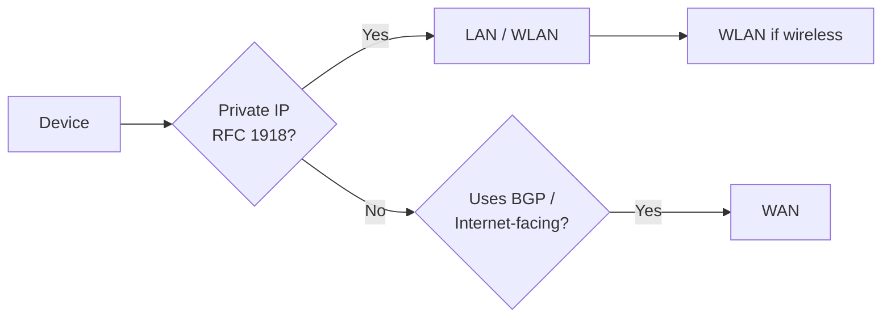

# Network Types

> Networks are classified by scope, ownership, and connectivity method — knowing the category tells you the routing, addressing, and security model to expect.

## Contents

1. [Core Concept](#01--core-concept)
2. [How It Works](#02--how-it-works)
3. [Key Components](#03--key-components)
4. [VPN Types](#04--vpn-types)
5. [Book Terms (GAN / MAN / PAN)](#05--book-terms-gan--man--pan)
6. [Security Perspective](#06--security-perspective)
7. [Common Mistakes](#07--common-mistakes)
8. [Quick Revision](#08--quick-revision)

---

## 01 — Core Concept

Network classification exists to describe **scope** (how far it reaches) and **access method** (wired/wireless/virtual). Two vocabularies exist:

- **Common Terms** — used daily in industry (WAN, LAN, WLAN, VPN).
- **Book Terms** — used in exams/certs, rarely spoken aloud (GAN, MAN, WPAN).

> [!NOTE]
> There is a single documented case of an email server failing to deliver mail over 500 miles — a reminder that physical distance and network design still matter, even in a cloud-first world.

---

## 02 — How It Works

Classification is determined by two practical signals, not just "size":

1. **Routing protocol in use** — WAN-facing networks use WAN-specific protocols like `BGP`.
2. **IP addressing scheme** — Private (RFC 1918) vs. Public/routable IP space.

---

## 03 — Key Components

### Common Terminology

| Network Type | Definition |
|---|---|
| **WAN** | Wide Area Network — "The Internet" |
| **LAN** | Local Area Network — internal network (home/office) |
| **WLAN** | Wireless LAN — internal network over Wi-Fi |
| **VPN** | Virtual Private Network — joins multiple sites into one logical LAN |

> [!INFO]
> **RFC 1918 — Private IP Ranges**
>
> `10.0.0.0/8` · `172.16.0.0/12` · `192.168.0.0/16`
> These ranges are never routed on the public Internet.

### WAN

- Commonly = **the Internet**, but not exclusively — a WAN is just many LANs joined together.
- Devices typically have a **WAN Address** (internet-facing) and a **LAN Address** (internal).
- Large orgs may run a private **Internal WAN** (a.k.a. *Intranet* or *Airgap Network*).
- **Identified by:** WAN routing protocol (e.g., `BGP`) + non-RFC-1918 IP space.

### LAN / WLAN

- Both use **RFC 1918** private addressing by default.
- Exception: some colleges/hotels hand out routable public IPs on their LAN.
- **Only difference:** WLAN adds wireless transmission — it's primarily a **security designation**, not a technical one.

---

## 04 — VPN Types

All three VPN types share one goal: make the user feel plugged into a remote network.

| VPN Type | Endpoints | Typical Use |
|---|---|---|
| **Site-to-Site** | Router ↔ Router / Firewall ↔ Firewall | Joining full company networks over the Internet |
| **Remote Access** | Client PC ↔ Network (virtual adapter, e.g. TUN) | Individual user joining a lab/corp network (e.g. HTB OpenVPN) |
| **SSL VPN** | Browser ↔ Server | Streaming apps/desktops through the browser (e.g. HTB Pwnbox) |

### Site-to-Site VPN
Both ends are **network devices** (routers/firewalls) sharing entire IP ranges — used to unite multiple company locations as if local.

### Remote Access VPN
Creates a **virtual interface** on the client (e.g., HTB's OpenVPN uses a `TUN` adapter).

> [!IMPORTANT]
> Check the **routing table** after connecting:
> - **Split-Tunnel VPN** → only specific networks (e.g. `10.10.10.0/24`) are routed through the VPN; regular Internet traffic stays local.
>   - ✅ Good for HTB labs (no privacy concern over your normal traffic).
>   - ⚠️ Risky for companies — malware traffic won't pass through network-based detection since it exits via the local Internet, not the VPN.

### SSL VPN
Runs inside the **web browser** — streams full apps or desktop sessions. Increasingly common as browsers gain capability.

---

## 05 — Book Terms (GAN / MAN / PAN)

| Network Type | Definition |
|---|---|
| **GAN** | Global Area Network — worldwide (the Internet) |
| **MAN** | Metropolitan Area Network — regional, multiple LANs |
| **WPAN** | Wireless Personal Area Network — personal, e.g. Bluetooth |

### GAN
Worldwide network built on **fiber-optic WAN infrastructure**, interconnected via **undersea cables or satellite**. The Internet is the most common example, but isolated global corporate networks also qualify.

### MAN
Connects multiple **LANs within a city/region**, typically via leased fiber lines and high-performance routers. Node-to-node speed rivals a LAN. MANs can nest into WANs, which nest into GANs.

### PAN / WPAN
- **PAN** — wired, ad-hoc connection between personal devices.
- **WPAN** — wireless, via **Bluetooth** or **Wireless USB**; a Bluetooth WPAN is called a **Piconet**.
- Range: only a few meters — not for cross-room/building use.
- **IoT relevance:** WPAN protocols like `Insteon`, `Z-Wave`, `ZigBee` power smart-home/low-data-rate control systems.

---

## 06 — Security Perspective

**Concept** → Network type defines addressing, scope, and trust boundary.
**Practical** → Identification relies on routing protocol + IP schema, not just "how big it feels."
**Security** →

- 🔴 **WAN/Internet-facing** → largest attack surface; public IP = directly reachable.
- 🟢 **RFC 1918 LAN/WLAN** → not directly Internet-routable, but pivoting from a compromised host still works.
- 🔴 **Split-Tunnel VPN in corporate use** → malware on the endpoint can exfiltrate via the local Internet path, bypassing network-based detection tied to VPN-monitored traffic.
- 🟡 **WPAN/Bluetooth (IoT)** → short range limits remote attacks but Piconet pairing and low-data protocols (ZigBee, Z-Wave) have known weak default security in smart-home deployments.
- 🟢 **Site-to-Site VPN** → good for trusted inter-office traffic, but a compromised router at one site can expose the entire shared range at the other site.

---

## 07 — Common Mistakes

> [!WARNING]
> - Assuming **WLAN = insecure by nature** — it's a wireless designation, not a security guarantee.
> - Confusing **VPN type** with **VPN purpose** — Remote Access VPN ≠ Site-to-Site VPN.
> - Forgetting to check **split-tunnel vs full-tunnel** before trusting a corporate VPN's monitoring coverage.
> - Treating **private IP space (RFC 1918)** as inherently "safe" — it just means non-routable, not non-attackable.

---

## 08 — Quick Revision

> [!IMPORTANT]
>
> ## Quick Revision
>
> - **WAN** = Internet-scale; identified by BGP + non-private IPs.
> - **LAN/WLAN** = private (RFC 1918) internal network; WLAN just adds wireless.
> - **VPN types**: Site-to-Site (network↔network), Remote Access (client↔network via virtual adapter), SSL VPN (browser-based).
> - **Split-tunnel** = only specific routes go through VPN — good for labs, risky for corporate malware detection.
> - **GAN > WAN > MAN > LAN/PAN** in descending scope; WPAN = short-range wireless (Bluetooth/IoT).
>
> **One-line takeaway:** Classify a network by its routing protocol and IP scheme, not by "how big it feels."

---

# ⚡ Final Cheat Sheet

**Private IP Ranges (RFC 1918):**
`10.0.0.0/8` · `172.16.0.0/12` · `192.168.0.0/16`

**Scope Hierarchy (small → large):**
`WPAN/PAN → LAN/WLAN → MAN → WAN → GAN`

**VPN Quick Map:**

| Type | Connects | Key Trait |
|---|---|---|
| Site-to-Site | Network devices | Shares full IP ranges |
| Remote Access | Client → Network | Virtual adapter (TUN); watch split vs. full tunnel |
| SSL VPN | Browser → Server | Streams apps/desktops (e.g. Pwnbox) |

**Identification Rule:**
`BGP + Public IP → WAN` | `Private IP (RFC 1918) → LAN/WLAN`

**IoT WPAN Protocols:** `Insteon` · `Z-Wave` · `ZigBee`

**Security Red Flag:** Split-tunnel VPN + corporate malware = detection blind spot.
