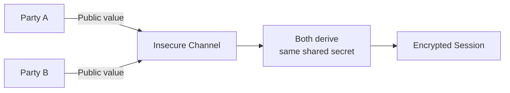
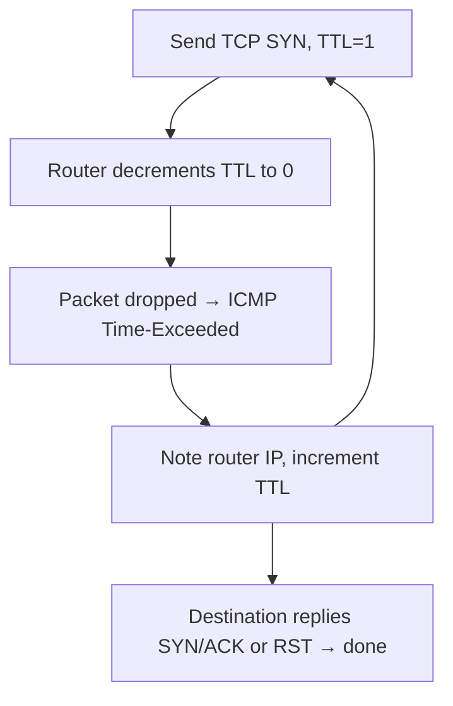
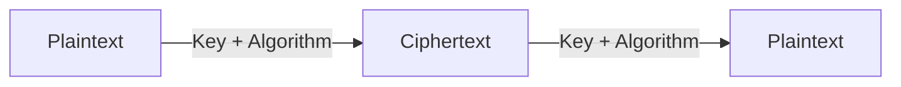

# Cybersecurity Fundamentals

> **Cryptography • Key Exchange • Authentication • Transport Layer**

## 📑 Index

| # | Topic | Core Idea | Jump |
|---|---|---|---|
| 01 | Key Exchange Mechanisms | How two parties agree on a shared secret over an insecure channel | [→](#01--key-exchange-mechanisms) |
| 02 | Authentication Protocols | Standardized ways to verify identity of users/devices | [→](#02--authentication-protocols) |
| 03 | TCP/UDP Connections | Reliable vs. fast data transport, wrapped in IP packets | [→](#03--tcpudp-connections) |
| 04 | Cryptography | Symmetric/asymmetric encryption, DES/AES, cipher modes | [→](#04--cryptography) |
| ⚡ | Final Cheat Sheet | All high-value facts, one screen | [→](#-final-cheat-sheet) |

---

# 01 — Key Exchange Mechanisms

> Methods for two parties to securely agree on a shared secret key over an insecure channel.

```text
┌──────────────────────────────────────┐
│ KEY EXCHANGE                          │
│                                       │
│ Goal     → Shared secret, no leaks   │
│ Risk     → MITM if unauthenticated   │
│ Backbone → TLS, VPNs, SSH            │
└──────────────────────────────────────┘
```

### How It Works



### Algorithms

| Algorithm | Acronym | Core Trait | Security Note |
|---|---|---|---|
| Diffie-Hellman | DH | Shared secret, zero prior contact | Vulnerable to MITM without auth; slower than ECDH |
| Rivest–Shamir–Adleman | RSA | Hard-to-factor large primes | Secure with adequate key size; heavier than ECC |
| Elliptic Curve DH | ECDH | ECC-based DH variant | Faster + provides forward secrecy |
| Elliptic Curve DSA | ECDSA | ECC-based digital signatures | Efficient party authentication |

> [!INFO]
> **RSA is also used for:** message encryption/signing · SSL/TLS data-in-transit · digital signature verification · Kerberos PKINIT authentication · protecting sensitive documents.

> [!INFO]
> **ECDH also enables:** TLS channel setup · forward secrecy (past sessions stay safe even if keys leak later) · IKE authentication in VPNs.

### IKE — Internet Key Exchange

Combines DH with other crypto techniques to build/maintain secure sessions (e.g. VPN tunnels). Often paired with RSA (exchange/signatures) + AES (data encryption).

| Mode | Phases | Trait |
|---|---|---|
| **Main Mode** | 3 | Default, more secure, slower — identity protected |
| **Aggressive Mode** | 2 | Faster, fewer round trips — **no identity protection** |

> [!CAUTION]
> **Pre-Shared Key (PSK):** optional secret authenticating both IKE parties. Must be exchanged **out-of-band** before the exchange starts. If compromised via MITM, the whole session's security collapses.

> [!WARNING]
> **Common Mistakes**
> * Trusting unauthenticated DH as MITM-proof — it isn't.
> * Picking Aggressive Mode purely for speed, ignoring lost identity protection.
> * Sending a PSK over an insecure channel — defeats its purpose.

> [!IMPORTANT]
> ## Quick Revision
> * **DH** → shared secret, MITM risk without auth
> * **RSA** → factoring-based; encryption + signatures + PKINIT
> * **ECDH** → faster DH + forward secrecy
> * **ECDSA** → ECC signatures
> * **IKE Main** (secure, 3-phase) vs **Aggressive** (fast, 2-phase, no identity protection)
>
> **Takeaway:** The exchange creates the secret; authentication (RSA/ECDSA/PSK) proves who you're exchanging it with.

---

# 02 — Authentication Protocols

> Standardized methods for verifying the identity of users, devices, and entities in a network.

```text
┌──────────────────────────────────────┐
│ AUTHENTICATION                        │
│                                       │
│ Purpose  → Verify identity            │
│ Failure  → Unauthorized access        │
│ Spectrum → Clear-text → Cert-based    │
└──────────────────────────────────────┘
```

### Protocol Reference

| Protocol | Description |
|---|---|
| **Kerberos** | KDC-based; tickets in domain environments |
| **SRP** | Password-based; resists eavesdropping + MITM |
| **SSL / TLS** | Cryptographic transport security (TLS = successor to SSL) |
| **OAuth** | Authorization — 3rd-party access without sharing passwords |
| **OpenID** | Decentralized — single identity, many sites |
| **SAML** | XML-based cross-party auth/authz data exchange |
| **PKI** | Public/private key system for encryption + signatures |
| **SSO** | One credential set, many applications |
| **2FA / MFA** | Two / multiple verification factors (know, have, are) |
| **PAP** | ⚠️ Sends password in **clear text** |
| **CHAP** | Three-way handshake verification |
| **EAP** | Pluggable framework for multiple auth methods |
| **SSH** | Encrypted remote CLI access, execution, file transfer |
| **HTTPS** | HTTP secured via SSL/TLS |
| **LEAP** | Cisco wireless EAP using RC4 — vulnerable, deprecated |
| **PEAP** | EAP + TLS tunnel — stronger, enterprise standard |

### LEAP vs PEAP

| Feature | LEAP | PEAP |
|---|---|---|
| Encryption | RC4 (weak) | AES / 3DES (strong) |
| Server auth | Shared secret, negotiated | Server-side certificate |
| MSCHAPv2 hash | Not encrypted | Encrypted |
| Status | Deprecated, dictionary-attack prone | Widely used in enterprise |

> [!SUCCESS]
> **SSH & HTTPS** default to SSL/TLS: strong encryption + PKI-based server certificates prevent both interception and MITM. Broad OS/device support makes them easy to deploy.

> [!WARNING]
> **Common Mistakes**
> * Using PAP or LEAP where credentials matter.
> * Assuming EAP itself is secure — it's a framework; security depends on the method plugged in (EAP-TLS vs. LEAP).
> * Confusing SSO (fewer logins) with MFA/2FA (more verification factors) — different problems.

> [!IMPORTANT]
> ## Quick Revision
> * **Kerberos** → ticket-based, KDC, domains
> * **PAP** → clear text (avoid) · **CHAP** → handshake · **EAP** → framework
> * **LEAP** → RC4, weak · **PEAP** → TLS-tunneled, certificate-based
> * **SSH/HTTPS** → SSL/TLS + PKI, MITM-resistant
>
> **Takeaway:** Strength = whether credentials are encrypted in transit **and** the server's identity is certificate-verified.

---

# 03 — TCP/UDP Connections

> TCP prioritizes reliability, UDP prioritizes speed — both carried inside IP packets.

### TCP vs UDP

| Feature | TCP | UDP |
|---|---|---|
| Connection | Yes | No |
| Reliability | High — retransmits lost data | Low — lost data stays lost |
| Speed | Slower | Faster |
| Analogy | Phone call (stays connected) | Dropped letter (no confirmation) |
| Use Case | Web pages, email | Streaming, gaming |

### IP Packet Anatomy

```text
┌───────────────────────────────┐
│ IP PACKET                     │
│ ┌───────────┐  ┌────────────┐ │
│ │  HEADER   │  │  PAYLOAD   │ │
│ │ routing/  │  │ actual     │ │
│ │ control   │  │ data       │ │
│ └───────────┘  └────────────┘ │
└───────────────────────────────┘
```

| Field | Description |
|---|---|
| Version | IP protocol version |
| Header Length | Header size in 32-bit words |
| Class of Service | Transmission priority |
| Total Length | Packet size in bytes |
| Identification (ID) | Fragment reassembly ID (16-bit, 0–65535) |
| Flags / Fragment Offset | Fragmentation control |
| TTL | Max hops/time on network |
| Protocol | TCP or UDP |
| Checksum | Header error detection |
| Source/Destination | Sender/receiver addresses |
| Options / Padding | Routing extras / word alignment |

> [!IMPORTANT]
> **IP ID Correlation (HTB Focus):** Sequential IDs across *different* source IPs strongly suggest the **same physical host**.
> ```text
> IP 10.129.1.100.5060 > 10.129.1.1.5060: id 1337
> IP 10.129.1.100.5060 > 10.129.1.1.5060: id 1338
> IP 10.129.1.100.5060 > 10.129.1.1.5060: id 1339
> IP 10.129.2.200.5060 > 10.129.1.1.5060: id 1340   ← different IP
> IP 10.129.2.200.5060 > 10.129.1.1.5060: id 1341   ← but continuous ID
> IP 10.129.2.200.5060 > 10.129.1.1.5060: id 1342
> ```

### Record-Route & Traceroute

```bash
ping -c 1 -R 10.129.143.158
```
**Purpose:** Force each hop to record its IP in the IP header's Record-Route field.



### TCP Segment Fields

| Field | Purpose |
|---|---|
| Source / Destination Port | App endpoints |
| Sequence Number | Data ordering |
| Acknowledgment Number | Confirms receipt |
| Control Flags | End/ACK/retransmit signals |
| Window Size | Receiver's buffer capacity |
| Checksum | Error detection |
| Urgent Pointer | Flags urgent payload data |

> [!WARNING]
> **Common Mistakes**
> * Dismissing UDP as inferior — it's optimized for speed, not reliability.
> * Ignoring IP ID sequencing as a recon signal for multi-homed hosts.
> * Confusing Record-Route (limited hops, IP-header based) with full traceroute.

> [!IMPORTANT]
> ## Quick Revision
> * **TCP** → reliable, connection-oriented, slower
> * **UDP** → fast, connectionless, no recovery
> * **IP packet** → header (routing) + payload (data)
> * **IP ID** → fragment ID; sequential across IPs = same host
> * **Traceroute** → TTL-increment + ICMP Time-Exceeded chain
>
> **Takeaway:** IP header fields double as diagnostics *and* reconnaissance signals.

---

# 04 — Cryptography

> Transforms data into unreadable form using symmetric or asymmetric keys.



### Symmetric vs Asymmetric

| Feature | Symmetric | Asymmetric |
|---|---|---|
| Keys | One shared key | Public + private pair |
| Speed | Fast | Slower |
| Key-exchange problem | Yes — major weakness | No — public key shareable |
| Use Case | Bulk data encryption | E-Signatures, SSL/TLS, VPNs, SSH, PKI, Cloud |
| Examples | AES, DES | RSA, PGP, ECC |

> [!TIP]
> **Why It Matters:** Asymmetric security rests on hard math problems (factoring, discrete logs) — no secret channel needed to share the public key, and it enables digital signatures for authentication.

### DES → 3DES → AES

| Standard | Key Size | Note |
|---|---|---|
| **DES** | 64-bit (56-bit effective, 8-bit checksum) | Encrypts 64-bit blocks to resist frequency analysis |
| **3DES** | 3× keys | Encrypt→Decrypt→Encrypt; still 56-bit limited |
| **AES-128/192/256** | 128/192/256-bit | Current standard; faster via multi-block processing |

**AES found in:** `WLAN 802.11i` · `IPsec` · `SSH` · `VoIP` · `PGP` · `OpenSSL`

### Cipher Modes

| Mode | Best For | Used In |
|---|---|---|
| **ECB** | ⚠️ Avoid — leaks data patterns | Legacy/insecure |
| **CBC** | Disk encryption, email — default AES mode | TrueCrypt, VeraCrypt, TLS, SSL |
| **CFB** | Real-time stream encryption | PKCS, BitLocker (in-transit) |
| **OFB** | Real-time streams, better keystream gen | PKCS, SSH |
| **CTR** | Real-time streams | IPsec, BitLocker |
| **GCM** | Confidentiality **+** integrity | Wireless, VPNs |

> [!CAUTION]
> **ECB is the mode to avoid** — identical plaintext blocks → identical ciphertext blocks, exposing patterns (classic: visible outlines when ECB-encrypting an image).

> [!WARNING]
> **Common Mistakes**
> * Using ECB mode for anything beyond trivial data.
> * Assuming DES/3DES still meet modern security bars.
> * Treating symmetric/asymmetric as interchangeable — they solve different problems.

> [!IMPORTANT]
> ## Quick Revision
> * **Symmetric** → one key, fast, key-exchange problem (AES, DES)
> * **Asymmetric** → key pair, solves exchange, enables signatures (RSA, PGP, ECC)
> * **DES** → 56-bit effective · **3DES** → 3-key extension · **AES** → 128/192/256-bit standard
> * **Cipher modes** → ECB (avoid), CBC (default), CFB/OFB/CTR (streams), GCM (confidentiality+integrity)
>
> **Takeaway:** Symmetric is fast but needs secure key exchange; asymmetric solves that at the cost of speed — cipher mode choice decides if it stays secure.

---

# ⚡ Final Cheat Sheet

### Key Exchange
`DH` (MITM risk, unauthenticated) · `RSA` (factoring) · `ECDH` (forward secrecy) · `ECDSA` (signatures)
IKE: **Main** = 3-phase, secure | **Aggressive** = 2-phase, no identity protection

### Authentication
Avoid: `PAP` · `LEAP` — Prefer: `PEAP` · `EAP-TLS` · `HTTPS` · `SSH`
`OAuth` = authorization · `OpenID` = authentication · `SAML` = XML cross-party exchange

### Transport
| | TCP | UDP |
|---|---|---|
| Reliable | ✅ | ❌ |
| Fast | ❌ | ✅ |

`IP ID` = 16-bit (0–65535) fragment/host fingerprint
Traceroute = `TTL++ → ICMP Time-Exceeded → repeat → SYN/ACK or RST`

### Cryptography
Symmetric: `AES (128/192/256)` > `3DES` > `DES (56-bit)`
Asymmetric: `RSA` · `PGP` · `ECC`
Modes: `ECB ⚠️ avoid` · `CBC = default` · `CFB/OFB/CTR = streams` · `GCM = confidentiality + integrity`

### Top Security Red Flags
* Unauthenticated DH exchange
* Aggressive Mode IKE (no identity protection)
* PAP / LEAP in production
* ECB cipher mode on structured data
* PSK sent over an insecure channel
